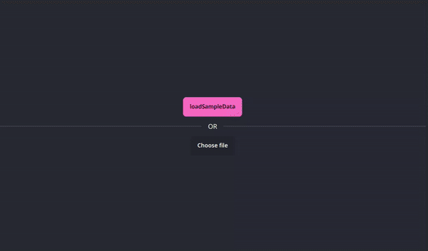

# Plan editor

This app helps to distribute addresses across days by utilizing the k-means clustering algorithm to group addresses into clusters representing different days. It features an intuitive drag and drop interface for easy address manipulation and highlights the day's distribution for better visual feedback.

### Tools
- Vite
- Vue 3
- Pug
- Sass
- TailwindCSS

### Fetures
- [x] **Editing plan**
  - [x] Using yamaps api to get adresses
  - [x] Auto distribute adresses over days (using kmeans algorithm to clusterize adresses in days)
  - [x] drag and drop feature
  - [x] day highlight feature
  - [ ] Adding adresses
- [x] **Loading csv file**
- [x] **Exporting plan**
- [x] **Responsive design**

